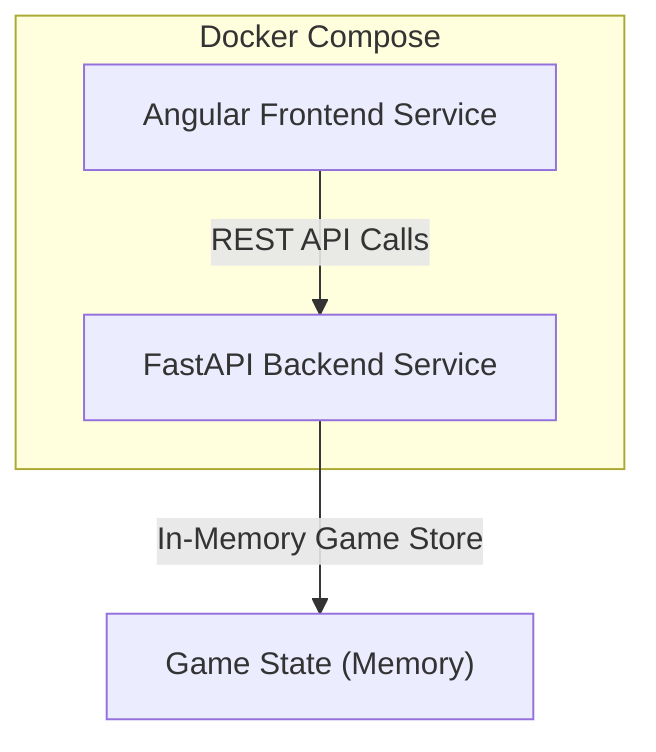

# Architect Mission Report

**Agent**: architect  
**Generated**: 2026-08-08T08:32:23.978Z

---

## Architecture Style

Client‑Server (modular monolith backend)

## Components

- **Frontend UI** (Web Application): Angular SPA that renders the player's board, opponent view, handles ship placement and firing actions.
- **Backend API** (REST Service): FastAPI application exposing endpoints for game creation, ship placement, firing shots, and board queries. Contains the game rules and updates the in‑memory store.
- **In-Memory Game Store** (State Management): Singleton Python object (dict + Pydantic models) that holds active games, board matrices, ship positions and turn information. Lives only in the backend process memory.

## Tech Stack

- **Frontend**: Angular 16 (TypeScript) — Angular provides built‑in routing, forms, and a component model that fits the grid UI. Its CLI generates a production‑ready Dockerfile. React and Vue are viable but would require additional state‑management libraries for the board, increasing complexity for a short assignment.
- **Backend**: FastAPI (Python 3.11) — FastAPI offers automatic OpenAPI documentation, async support, and Pydantic validation, reducing boilerplate for request/response models. Flask would need manual validation and docs; Express adds JavaScript runtime overhead and lacks built‑in data validation.
- **Containerization**: Docker — Docker is universally available, integrates with Docker Compose, and matches the assignment requirement. Podman/Buildah are compatible but less common in CI pipelines.
- **Orchestration**: Docker Compose — Compose handles multi‑container startup with minimal config, sufficient for two services. Kubernetes is overkill for a simple demo; Swarm adds complexity without benefits.
- **In-Memory Data Store**: Python native dict with Pydantic models — Game state is transient and limited to a single process; native structures avoid external dependencies. Redis would add network overhead; SQLite is unnecessary for simple mutable objects.
- **Testing**: pytest for backend, Karma/Jasmine for Angular — pytest is the de‑facto standard for Python, easy to write. unittest is more verbose. Karma/Jasmine integrates with Angular CLI; Jest is more common with React.
- **CI/CD**: GitHub Actions with Docker build — GitHub Actions is free, integrates directly with the repository, and can run Docker builds. Other services are viable but would require additional setup.
- **Observability**: Standard stdout logging (Python logging, Angular console) — For a demo, simple logs suffice. Full ELK or Prometheus would be unnecessary overhead.

## Epics

- **E1** Create Game Session API: Backend endpoint to start a new game and return a unique game identifier. Frontend calls this on load to obtain a session token.
- **E2** Ship Placement UI and API: Allow Player 1 to place three ships (sizes 2, 3, 4) on a 6×6 board with validation (no overlap, within bounds). UI sends placement data; backend validates and stores the positions.
- **E3** Turn‑Based Shooting: Implement firing shots, hit/miss detection, turn enforcement, and win condition. Backend updates game state and returns result; UI reflects hits, misses, and game‑over status.
- **E4** Board Rendering: Display the player's own board (showing ships) and the opponent view (showing only hits and misses). UI updates reactively after each action.
- **E5** Docker Compose Deployment: Containerize the Angular frontend and FastAPI backend, provide a single docker‑compose.yml that builds and runs both services with one command.

## Architecture Diagram

