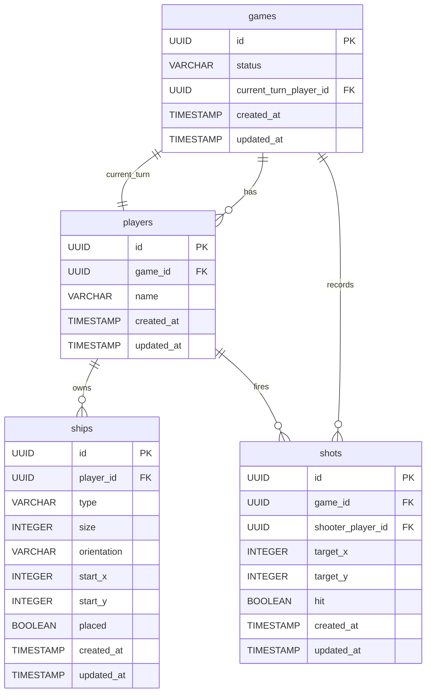

# DBA Mission Report

**Agent**: dba  
**Generated**: 2026-08-08T08:33:01.146Z

---

## Database Engine: In-Memory Python dict with Pydantic models (no external RDBMS)

The architecture explicitly uses a singleton Python object (dict + Pydantic) to hold active game state. Introducing an external DB would add unnecessary complexity and violate the design decision of a single‑container, transient store. Using in‑memory structures keeps latency to zero, aligns with the FastAPI + Python stack, and satisfies the requirement that data is isolated per game ID and never persisted.

## Entities (4)

- **games**: 5 columns
- **players**: 5 columns
- **ships**: 10 columns
- **shots**: 8 columns

## ERD

